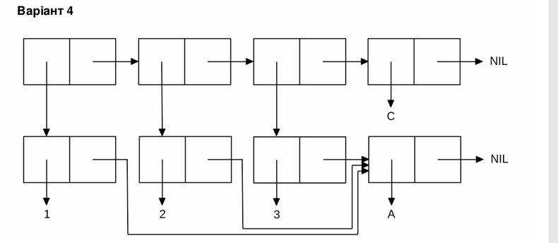

# FP
<p align="center"><b>МОНУ НТУУ КПІ ім. Ігоря Сікорського ФПМ СПіСКС</b></p>
<p align="center">
<b>Звіт з лабораторної роботи 1</b><br/>
"Обробка списків з використанням базових функцій"<br/>
дисципліни "Вступ до функціонального програмування"
</p>
<p align="right"><b>Студентка:</b> <i> Пильова Д.М  КВ-11</i><p>
<p align="right"><b>Рік:</b> <i>2024</i><p>

## Загальне завдання

1. Створіть список з п'яти елементів, використовуючи функції LIST і CONS . Форма
створення списку має бути одна — використання SET чи SETQ (або інших
допоміжних форм) для збереження проміжних значень не допускається. Загальна
кількість елементів (включно з підсписками та їх елементами) не має перевищувати
10-12 шт. (дуже великий список робити не потрібно). Збережіть створений список у
якусь змінну з SET або SETQ . Список має містити (напряму або у підсписках):
    - хоча б один символ
    - хоча б одне число
    - хоча б один не пустий підсписок
    - хоча б один пустий підсписок
2. Отримайте голову списку.
3. Отримайте хвіст списку.
4. Отримайте третій елемент списку.
5. Отримайте останній елемент списку.
6. Використайте предикати ATOM та LISTP на різних елементах списку (по 2-3
приклади для кожної функції).
7. Використайте на елементах списку 2-3 інших предикати з розглянутих у розділі 4
навчального посібника.
8. Об'єднайте створений список з одним із його непустих підсписків. Для цього
використайте функцію APPEND.

```lisp
;; Пункт 1
* (defvar list1)
LIST1
* (setq list1 (list 'a 1 (list 'b 2) '() (cons 'c nil)))
(A 1 (B 2) NIL (C))

;; Пункт 2
* (car list1)
A

;; Пункт 3
* (cdr list1)
(1 (B 2) NIL (C))

;; Пункт 4
* (third list1)
(B 2)

;; Пункт 5
* (car (last list1))
(C)

;; Пункт 6
* (atom (car list1))
T
* (atom (third list1)) 
NIL
* (listp (second list1))
NIL
* (listp (fourth list1))
T

;; Пункт 7
* (eq (car list1) (last list1))
NIL
* (< (second list1) (second (third list1)))                          
T
* (> (second list1) (second (third list1)))
NIL

;; Пункт 8
* (append list1 (third list1))
(A 1 (B 2) NIL (C) B 2)

```

## Варіант 4
<p align="center">

</p>

Створіть список, що відповідає структурі списку, наведеній на рисунку
Для цього допускається використання не більше двох форм.

```lisp
;; Спосіб 1
* (defvar x nil)
X
* (setq x (cons 'a NIL))
(A)
* (list (list* 1 x) (list* 2 x) (list* 3 x) 'c)
((1 A) (2 A) (3 A) C)

;; Спосіб 2 (рекурсія)
* (defun build-list (x n i)
    (if (= n 0)
        '(c)
        (cons (list i x) (build-list x (- n 1) (+ i 1)))
    )      
)
BUILD-LIST
* (let ((x 'a)) (build-list x 3 1))
((1 A) (2 A) (3 A) C)
```
